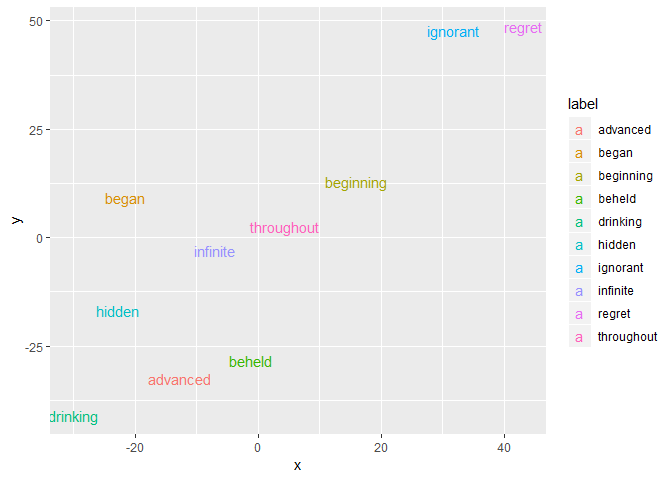

<!-- README.md is generated from README.Rmd. Please edit that file -->

# scdv

An R package for SCDV (Sparse Composite Document Vectors) algorithm

[](https://travis-ci.com/teramonagi/scdv)
[](https://cran.r-project.org/package=scdv)

## Installation

``` r
# install.packages("gghighlight")

# The development version from GitHub:
# install.packages("devtools")
devtools::install_github("teramonagi/scdv")
```

## Example

### Get (sample) data and do pre-processing

``` r
library(scdv)
# Get example document from Project Gutenberg (http://www.gutenberg.org/wiki/Main_Page)
urls <- c(
  "http://www.gutenberg.org/files/98/98-0.txt",
  "http://www.gutenberg.org/files/1342/1342-0.txt"
)
x <- purrr::map(urls, ~ httr::content(httr::GET(.x)))
doc <- purrr::map(x, ~ tokenizers::tokenize_words(.x, stopwords = stopwords::stopwords("en"))[[1]])
```

### Calculate SCDV(Sparse Composite Document Vector)

``` r
# Set the number of cluster (k), and the word2vec dimension (dimension)
k <- 10
dimension <- 100
# Calculate Sparse Composite Document Vector
dv <- scdv::scdv(doc, k, dimension)
#> Starting training using file /private/var/folders/pw/st6p3hlj2d983lfsq6jx4np00000gp/T/RtmppkJpJ8/filead753b63fc55
#> 100K
Vocab size: 3896
#> Words in train file: 107904
#> Filename ends with .bin, so reading in binary format
#> Reading a word2vec binary file of 3896 rows and 100 columns
#> 
  |                                                                       
  |                                                                 |   0%
  |                                                                       
  |                                                                 |   1%
  |                                                                       
  |=                                                                |   1%
  |                                                                       
  |=                                                                |   2%
  |                                                                       
  |==                                                               |   2%
  |                                                                       
  |==                                                               |   3%
  |                                                                       
  |==                                                               |   4%
  |                                                                       
  |===                                                              |   4%
  |                                                                       
  |===                                                              |   5%
  |                                                                       
  |====                                                             |   5%
  |                                                                       
  |====                                                             |   6%
  |                                                                       
  |====                                                             |   7%
  |                                                                       
  |=====                                                            |   7%
  |                                                                       
  |=====                                                            |   8%
  |                                                                       
  |======                                                           |   8%
  |                                                                       
  |======                                                           |   9%
  |                                                                       
  |======                                                           |  10%
  |                                                                       
  |=======                                                          |  10%
  |                                                                       
  |=======                                                          |  11%
  |                                                                       
  |=======                                                          |  12%
  |                                                                       
  |========                                                         |  12%
  |                                                                       
  |========                                                         |  13%
  |                                                                       
  |=========                                                        |  13%
  |                                                                       
  |=========                                                        |  14%
  |                                                                       
  |=========                                                        |  15%
  |                                                                       
  |==========                                                       |  15%
  |                                                                       
  |==========                                                       |  16%
  |                                                                       
  |===========                                                      |  16%
  |                                                                       
  |===========                                                      |  17%
  |                                                                       
  |===========                                                      |  18%
  |                                                                       
  |============                                                     |  18%
  |                                                                       
  |============                                                     |  19%
  |                                                                       
  |=============                                                    |  19%
  |                                                                       
  |=============                                                    |  20%
  |                                                                       
  |=============                                                    |  21%
  |                                                                       
  |==============                                                   |  21%
  |                                                                       
  |==============                                                   |  22%
  |                                                                       
  |===============                                                  |  22%
  |                                                                       
  |===============                                                  |  23%
  |                                                                       
  |===============                                                  |  24%
  |                                                                       
  |================                                                 |  24%
  |                                                                       
  |================                                                 |  25%
  |                                                                       
  |=================                                                |  25%
  |                                                                       
  |=================                                                |  26%
  |                                                                       
  |=================                                                |  27%
  |                                                                       
  |==================                                               |  27%
  |                                                                       
  |==================                                               |  28%
  |                                                                       
  |===================                                              |  28%
  |                                                                       
  |===================                                              |  29%
  |                                                                       
  |===================                                              |  30%
  |                                                                       
  |====================                                             |  30%
  |                                                                       
  |====================                                             |  31%
  |                                                                       
  |====================                                             |  32%
  |                                                                       
  |=====================                                            |  32%
  |                                                                       
  |=====================                                            |  33%
  |                                                                       
  |======================                                           |  33%
  |                                                                       
  |======================                                           |  34%
  |                                                                       
  |======================                                           |  35%
  |                                                                       
  |=======================                                          |  35%
  |                                                                       
  |=======================                                          |  36%
  |                                                                       
  |========================                                         |  36%
  |                                                                       
  |========================                                         |  37%
  |                                                                       
  |========================                                         |  38%
  |                                                                       
  |=========================                                        |  38%
  |                                                                       
  |=========================                                        |  39%
  |                                                                       
  |==========================                                       |  39%
  |                                                                       
  |==========================                                       |  40%
  |                                                                       
  |==========================                                       |  41%
  |                                                                       
  |===========================                                      |  41%
  |                                                                       
  |===========================                                      |  42%
  |                                                                       
  |============================                                     |  42%
  |                                                                       
  |============================                                     |  43%
  |                                                                       
  |============================                                     |  44%
  |                                                                       
  |=============================                                    |  44%
  |                                                                       
  |=============================                                    |  45%
  |                                                                       
  |==============================                                   |  45%
  |                                                                       
  |==============================                                   |  46%
  |                                                                       
  |==============================                                   |  47%
  |                                                                       
  |===============================                                  |  47%
  |                                                                       
  |===============================                                  |  48%
  |                                                                       
  |================================                                 |  48%
  |                                                                       
  |================================                                 |  49%
  |                                                                       
  |================================                                 |  50%
  |                                                                       
  |=================================                                |  50%
  |                                                                       
  |=================================                                |  51%
  |                                                                       
  |=================================                                |  52%
  |                                                                       
  |==================================                               |  52%
  |                                                                       
  |==================================                               |  53%
  |                                                                       
  |===================================                              |  53%
  |                                                                       
  |===================================                              |  54%
  |                                                                       
  |===================================                              |  55%
  |                                                                       
  |====================================                             |  55%
  |                                                                       
  |====================================                             |  56%
  |                                                                       
  |=====================================                            |  56%
  |                                                                       
  |=====================================                            |  57%
  |                                                                       
  |=====================================                            |  58%
  |                                                                       
  |======================================                           |  58%
  |                                                                       
  |======================================                           |  59%
  |                                                                       
  |=======================================                          |  59%
  |                                                                       
  |=======================================                          |  60%
  |                                                                       
  |=======================================                          |  61%
  |                                                                       
  |========================================                         |  61%
  |                                                                       
  |========================================                         |  62%
  |                                                                       
  |=========================================                        |  62%
  |                                                                       
  |=========================================                        |  63%
  |                                                                       
  |=========================================                        |  64%
  |                                                                       
  |==========================================                       |  64%
  |                                                                       
  |==========================================                       |  65%
  |                                                                       
  |===========================================                      |  65%
  |                                                                       
  |===========================================                      |  66%
  |                                                                       
  |===========================================                      |  67%
  |                                                                       
  |============================================                     |  67%
  |                                                                       
  |============================================                     |  68%
  |                                                                       
  |=============================================                    |  68%
  |                                                                       
  |=============================================                    |  69%
  |                                                                       
  |=============================================                    |  70%
  |                                                                       
  |==============================================                   |  70%
  |                                                                       
  |==============================================                   |  71%
  |                                                                       
  |==============================================                   |  72%
  |                                                                       
  |===============================================                  |  72%
  |                                                                       
  |===============================================                  |  73%
  |                                                                       
  |================================================                 |  73%
  |                                                                       
  |================================================                 |  74%
  |                                                                       
  |================================================                 |  75%
  |                                                                       
  |=================================================                |  75%
  |                                                                       
  |=================================================                |  76%
  |                                                                       
  |==================================================               |  76%
  |                                                                       
  |==================================================               |  77%
  |                                                                       
  |==================================================               |  78%
  |                                                                       
  |===================================================              |  78%
  |                                                                       
  |===================================================              |  79%
  |                                                                       
  |====================================================             |  79%
  |                                                                       
  |====================================================             |  80%
  |                                                                       
  |====================================================             |  81%
  |                                                                       
  |=====================================================            |  81%
  |                                                                       
  |=====================================================            |  82%
  |                                                                       
  |======================================================           |  82%
  |                                                                       
  |======================================================           |  83%
  |                                                                       
  |======================================================           |  84%
  |                                                                       
  |=======================================================          |  84%
  |                                                                       
  |=======================================================          |  85%
  |                                                                       
  |========================================================         |  85%
  |                                                                       
  |========================================================         |  86%
  |                                                                       
  |========================================================         |  87%
  |                                                                       
  |=========================================================        |  87%
  |                                                                       
  |=========================================================        |  88%
  |                                                                       
  |==========================================================       |  88%
  |                                                                       
  |==========================================================       |  89%
  |                                                                       
  |==========================================================       |  90%
  |                                                                       
  |===========================================================      |  90%
  |                                                                       
  |===========================================================      |  91%
  |                                                                       
  |===========================================================      |  92%
  |                                                                       
  |============================================================     |  92%
  |                                                                       
  |============================================================     |  93%
  |                                                                       
  |=============================================================    |  93%
  |                                                                       
  |=============================================================    |  94%
  |                                                                       
  |=============================================================    |  95%
  |                                                                       
  |==============================================================   |  95%
  |                                                                       
  |==============================================================   |  96%
  |                                                                       
  |===============================================================  |  96%
  |                                                                       
  |===============================================================  |  97%
  |                                                                       
  |===============================================================  |  98%
  |                                                                       
  |================================================================ |  98%
  |                                                                       
  |================================================================ |  99%
  |                                                                       
  |=================================================================|  99%
  |                                                                       
  |=================================================================| 100%
```

### Calculate embedding expression by word2vec and visualize these

``` r
# Calculate embedding expression by word2vec
wv <- scdv::word2vec(doc, dimension)
#> Starting training using file /private/var/folders/pw/st6p3hlj2d983lfsq6jx4np00000gp/T/RtmppkJpJ8/filead7572ed3672
#> 200K
Vocab size: 3896
#> Words in train file: 107904
#> Filename ends with .bin, so reading in binary format
#> Reading a word2vec binary file of 3896 rows and 100 columns
#> 
  |                                                                       
  |                                                                 |   0%
  |                                                                       
  |                                                                 |   1%
  |                                                                       
  |=                                                                |   1%
  |                                                                       
  |=                                                                |   2%
  |                                                                       
  |==                                                               |   2%
  |                                                                       
  |==                                                               |   3%
  |                                                                       
  |==                                                               |   4%
  |                                                                       
  |===                                                              |   4%
  |                                                                       
  |===                                                              |   5%
  |                                                                       
  |====                                                             |   5%
  |                                                                       
  |====                                                             |   6%
  |                                                                       
  |====                                                             |   7%
  |                                                                       
  |=====                                                            |   7%
  |                                                                       
  |=====                                                            |   8%
  |                                                                       
  |======                                                           |   8%
  |                                                                       
  |======                                                           |   9%
  |                                                                       
  |======                                                           |  10%
  |                                                                       
  |=======                                                          |  10%
  |                                                                       
  |=======                                                          |  11%
  |                                                                       
  |=======                                                          |  12%
  |                                                                       
  |========                                                         |  12%
  |                                                                       
  |========                                                         |  13%
  |                                                                       
  |=========                                                        |  13%
  |                                                                       
  |=========                                                        |  14%
  |                                                                       
  |=========                                                        |  15%
  |                                                                       
  |==========                                                       |  15%
  |                                                                       
  |==========                                                       |  16%
  |                                                                       
  |===========                                                      |  16%
  |                                                                       
  |===========                                                      |  17%
  |                                                                       
  |===========                                                      |  18%
  |                                                                       
  |============                                                     |  18%
  |                                                                       
  |============                                                     |  19%
  |                                                                       
  |=============                                                    |  19%
  |                                                                       
  |=============                                                    |  20%
  |                                                                       
  |=============                                                    |  21%
  |                                                                       
  |==============                                                   |  21%
  |                                                                       
  |==============                                                   |  22%
  |                                                                       
  |===============                                                  |  22%
  |                                                                       
  |===============                                                  |  23%
  |                                                                       
  |===============                                                  |  24%
  |                                                                       
  |================                                                 |  24%
  |                                                                       
  |================                                                 |  25%
  |                                                                       
  |=================                                                |  25%
  |                                                                       
  |=================                                                |  26%
  |                                                                       
  |=================                                                |  27%
  |                                                                       
  |==================                                               |  27%
  |                                                                       
  |==================                                               |  28%
  |                                                                       
  |===================                                              |  28%
  |                                                                       
  |===================                                              |  29%
  |                                                                       
  |===================                                              |  30%
  |                                                                       
  |====================                                             |  30%
  |                                                                       
  |====================                                             |  31%
  |                                                                       
  |====================                                             |  32%
  |                                                                       
  |=====================                                            |  32%
  |                                                                       
  |=====================                                            |  33%
  |                                                                       
  |======================                                           |  33%
  |                                                                       
  |======================                                           |  34%
  |                                                                       
  |======================                                           |  35%
  |                                                                       
  |=======================                                          |  35%
  |                                                                       
  |=======================                                          |  36%
  |                                                                       
  |========================                                         |  36%
  |                                                                       
  |========================                                         |  37%
  |                                                                       
  |========================                                         |  38%
  |                                                                       
  |=========================                                        |  38%
  |                                                                       
  |=========================                                        |  39%
  |                                                                       
  |==========================                                       |  39%
  |                                                                       
  |==========================                                       |  40%
  |                                                                       
  |==========================                                       |  41%
  |                                                                       
  |===========================                                      |  41%
  |                                                                       
  |===========================                                      |  42%
  |                                                                       
  |============================                                     |  42%
  |                                                                       
  |============================                                     |  43%
  |                                                                       
  |============================                                     |  44%
  |                                                                       
  |=============================                                    |  44%
  |                                                                       
  |=============================                                    |  45%
  |                                                                       
  |==============================                                   |  45%
  |                                                                       
  |==============================                                   |  46%
  |                                                                       
  |==============================                                   |  47%
  |                                                                       
  |===============================                                  |  47%
  |                                                                       
  |===============================                                  |  48%
  |                                                                       
  |================================                                 |  48%
  |                                                                       
  |================================                                 |  49%
  |                                                                       
  |================================                                 |  50%
  |                                                                       
  |=================================                                |  50%
  |                                                                       
  |=================================                                |  51%
  |                                                                       
  |=================================                                |  52%
  |                                                                       
  |==================================                               |  52%
  |                                                                       
  |==================================                               |  53%
  |                                                                       
  |===================================                              |  53%
  |                                                                       
  |===================================                              |  54%
  |                                                                       
  |===================================                              |  55%
  |                                                                       
  |====================================                             |  55%
  |                                                                       
  |====================================                             |  56%
  |                                                                       
  |=====================================                            |  56%
  |                                                                       
  |=====================================                            |  57%
  |                                                                       
  |=====================================                            |  58%
  |                                                                       
  |======================================                           |  58%
  |                                                                       
  |======================================                           |  59%
  |                                                                       
  |=======================================                          |  59%
  |                                                                       
  |=======================================                          |  60%
  |                                                                       
  |=======================================                          |  61%
  |                                                                       
  |========================================                         |  61%
  |                                                                       
  |========================================                         |  62%
  |                                                                       
  |=========================================                        |  62%
  |                                                                       
  |=========================================                        |  63%
  |                                                                       
  |=========================================                        |  64%
  |                                                                       
  |==========================================                       |  64%
  |                                                                       
  |==========================================                       |  65%
  |                                                                       
  |===========================================                      |  65%
  |                                                                       
  |===========================================                      |  66%
  |                                                                       
  |===========================================                      |  67%
  |                                                                       
  |============================================                     |  67%
  |                                                                       
  |============================================                     |  68%
  |                                                                       
  |=============================================                    |  68%
  |                                                                       
  |=============================================                    |  69%
  |                                                                       
  |=============================================                    |  70%
  |                                                                       
  |==============================================                   |  70%
  |                                                                       
  |==============================================                   |  71%
  |                                                                       
  |==============================================                   |  72%
  |                                                                       
  |===============================================                  |  72%
  |                                                                       
  |===============================================                  |  73%
  |                                                                       
  |================================================                 |  73%
  |                                                                       
  |================================================                 |  74%
  |                                                                       
  |================================================                 |  75%
  |                                                                       
  |=================================================                |  75%
  |                                                                       
  |=================================================                |  76%
  |                                                                       
  |==================================================               |  76%
  |                                                                       
  |==================================================               |  77%
  |                                                                       
  |==================================================               |  78%
  |                                                                       
  |===================================================              |  78%
  |                                                                       
  |===================================================              |  79%
  |                                                                       
  |====================================================             |  79%
  |                                                                       
  |====================================================             |  80%
  |                                                                       
  |====================================================             |  81%
  |                                                                       
  |=====================================================            |  81%
  |                                                                       
  |=====================================================            |  82%
  |                                                                       
  |======================================================           |  82%
  |                                                                       
  |======================================================           |  83%
  |                                                                       
  |======================================================           |  84%
  |                                                                       
  |=======================================================          |  84%
  |                                                                       
  |=======================================================          |  85%
  |                                                                       
  |========================================================         |  85%
  |                                                                       
  |========================================================         |  86%
  |                                                                       
  |========================================================         |  87%
  |                                                                       
  |=========================================================        |  87%
  |                                                                       
  |=========================================================        |  88%
  |                                                                       
  |==========================================================       |  88%
  |                                                                       
  |==========================================================       |  89%
  |                                                                       
  |==========================================================       |  90%
  |                                                                       
  |===========================================================      |  90%
  |                                                                       
  |===========================================================      |  91%
  |                                                                       
  |===========================================================      |  92%
  |                                                                       
  |============================================================     |  92%
  |                                                                       
  |============================================================     |  93%
  |                                                                       
  |=============================================================    |  93%
  |                                                                       
  |=============================================================    |  94%
  |                                                                       
  |=============================================================    |  95%
  |                                                                       
  |==============================================================   |  95%
  |                                                                       
  |==============================================================   |  96%
  |                                                                       
  |===============================================================  |  96%
  |                                                                       
  |===============================================================  |  97%
  |                                                                       
  |===============================================================  |  98%
  |                                                                       
  |================================================================ |  98%
  |                                                                       
  |================================================================ |  99%
  |                                                                       
  |=================================================================|  99%
  |                                                                       
  |=================================================================| 100%
scdv::visualize(wv[sample(nrow(wv), size = 10), ])
```

<!-- -->

``` r
# You can also visualize document vecotr like
# scdv::visualize(dv)
```
