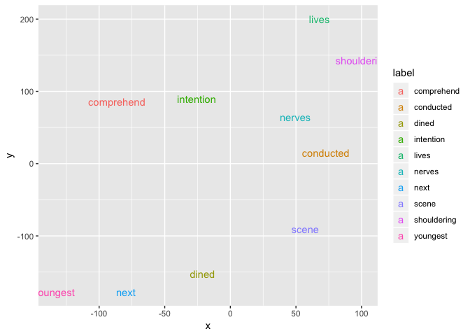

<!-- README.md is generated from README.Rmd. Please edit that file -->

# scdv

An R package for SCDV (Sparse Composite Document Vectors) algorithm

[](https://travis-ci.com/teramonagi/scdv)
<!-- [](https://cran.r-project.org/package=scdv) -->

## Installation

``` r
# Wait for a while...
# install.packages("scdv")

# The development version from GitHub:
# install.packages("devtools")
devtools::install_github("teramonagi/scdv")
```

## Example

### Get (sample) data and do pre-processing

``` r
library(scdv)
# Get example document from Project Gutenberg (http://www.gutenberg.org/wiki/Main_Page)
urls <- c(
  "http://www.gutenberg.org/files/98/98-0.txt",
  "http://www.gutenberg.org/files/1342/1342-0.txt"
)
x <- purrr::map(urls, ~ httr::content(httr::GET(.x)))
# pre-processing for each document
doc <- purrr::map(x, ~ tokenizers::tokenize_words(.x, stopwords = stopwords::stopwords("en"))[[1]])
doc[[1]][1:10]
#>  [1] "project"   "gutenberg" "ebook"     "tale"      "two"      
#>  [6] "cities"    "charles"   "dickens"   "ebook"     "use"
```

### Calculate SCDV(Sparse Composite Document Vector)

``` r
# Set the number of cluster (k), and the word2vec dimension (dimension)
k <- 10
dimension <- 30
# Calculate Sparse Composite Document Vector
dv <- scdv::scdv(doc, k, dimension, word2vec_args = list(show_by=25))
#> Starting training using file /private/var/folders/pw/st6p3hlj2d983lfsq6jx4np00000gp/T/RtmpwR8oA4/filea3bd7a9fe33
#> 100K
Vocab size: 3896
#> Words in train file: 107904
#> 
  |                                                                       
  |                                                                 |   0%
  |                                                                       
  |================                                                 |  25%
  |                                                                       
  |================================                                 |  50%
  |                                                                       
  |================================================                 |  75%
  |                                                                       
  |=================================================================| 100%
```

### Calculate embedding expression by word2vec and visualize these

``` r
# Calculate embedding expression by word2vec
wv <- scdv::word2vec(doc, dimension, args = list(show_by=25))
#> Starting training using file /private/var/folders/pw/st6p3hlj2d983lfsq6jx4np00000gp/T/RtmpRVXKH9/filea3cf4e133f59
#> 100K
Vocab size: 3896
#> Words in train file: 107904
#> 
  |                                                                       
  |                                                                 |   0%
  |                                                                       
  |================                                                 |  25%
  |                                                                       
  |================================                                 |  50%
  |                                                                       
  |================================================                 |  75%
  |                                                                       
  |=================================================================| 100%
```

``` r
# Sample row and visualize
scdv::visualize(wv[sample(nrow(wv), size = 10), ])
```

<!-- -->

``` r
# You can also visualize document vecotr like
#scdv::visualize(dv)
```
